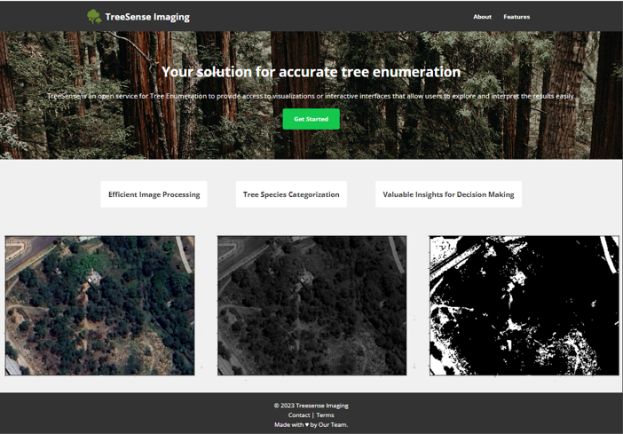
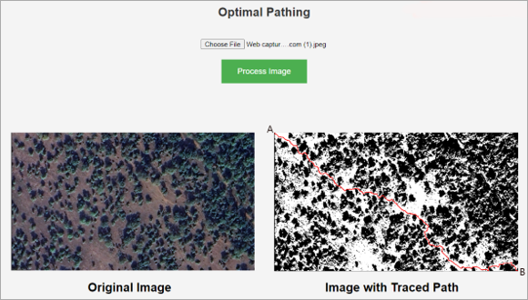
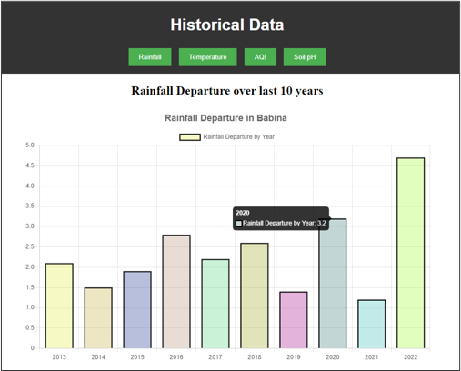

# Smart India Hackathon: TreeSense Imaging

## Image Analytics for Tree Enumeration
The project aims to address the challenge of accurately enumerating trees in forest areas earmarked for diversion due to developmental projects by developing an image analytics system utilizing satellite imagery or aerial photographs to automate tree enumeration. Traditional methods are time-consuming and prone to errors, making it crucial to develop an automated solution.

## Overview
The project includes a website with a landing page and a dashboard offering the following tools:

- **Tree Count:** Allows accurate tree counting within designated forest areas.
- **Green Cover Estimator:** Estimates green cover percentage.
- **Tree Species Identifier:** Identifies tree species.
- **Optimal Pathing:** Computes the optimal path between two points within the area.
- **Historical Data:** Provides historical data for analysis and comparison.

## Features
- Landing Page: Showcases project overview with easy onboarding.
- Dashboard: Offers toggle switches to access various tools.
- Interface: User-friendly interface for easy interaction and exploration of results.
- Integration: Seamless integration with forest management systems.
- Visualization: Generates maps, reports, and visual representations of tree enumeration data.

## Screenshots

*Landing page showcasing project overview.*

*Dashboard with the Tree Count tool*

*Green Cover Estimator tool activated.*

*Optimal Pathing tool activated.*

*Historical Data Results*

## Getting Started
To start using the tools, visit the website and navigate to the dashboard [here.](https://treesense.vipulchaturvedi.com/predict)

## Contributions
Contributions are welcome! Please open a PR to get started on contributing to the project.

## License
This project is licensed under GNU AGPLv3
